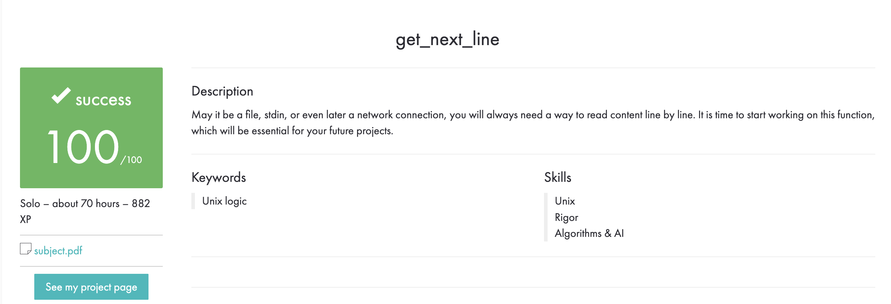

# Português 🇧🇷🇵🇹

<details>
  <summary>
    Saiba mais
  </summary>
  
  # Get Next Line
Projeto da [42](https://www.42lisboa.com) - Rank 1 - Get Next Line

<details>
  <summary><strong>🏆 Meu desempenho</strong></summary><br />

  
</details>

## 📌 Habilidades

> Habilidades desenvolvidas:

- Utilização de ponteiros
- Noções de endereço de memória
- Noções de alocação e dealocação de memória
- Entendimento sobre variáveis estáticas
- Manipulação de memória
- Entendimento das funções "read", "open" e "close"

## ‍💻 Softwares necessários

- C compiler (clang)

## ⬇️ Compilando arquivos

```bash
	dica: Compile com as flags -Wall -Wextra -Werror -g -fsanitize=address
	cc (flags/caso queira) "main.c" get_next_line.c get_next_line_utils.c -o gnl
```

## ⚡ Testando o projeto

```
	Para testar este projeto é necessário um arquivo de teste, pode utilizar o arquivo "main.c" como base.
```

## Time de desenvolvimento

> Projeto individual:

<table>
    <tr>
      <td>
        
        <h4 align="center">Alê Rabelo</h4>
      </td>
    </tr>
  </table>

## 💬 Contatos

<div align="center" style="display: inline_block">
  <a href="https://www.linkedin.com/in/al%C3%AA-emmanuel-rabelo-guedes/" target="_blank">
    
  </a> 
   <a href="mailto:rabeloguedes@proton.me">
     
  </a>
</div>

</details>

# English 🇺🇸🇬🇧

<details>
  <summary>
    More
  </summary>
  
  # Get Next Line
Project from [42](https://www.42lisboa.com/) - Rank 1 - Get Next Line

<details>
  <summary><strong>🏆 My accomplishment</strong></summary><br />

  

</details>

## 📌 Skills

> Practiced skills:

- Use of pointers
- Understanding of memory address
- Understanding of memory allocation and deallocation
- Understanding of static variables
- Memory manipulation
- Understanding of "read", "open" and "close" functions

## ‍💻 Required Softwares

- C compiler (clang)

## ⬇️ Compiling files

```bash
	tip: Compile with flags -Wall -Wextra -Werror -g -fsanitize=address
	cc (flags/if you want) "main.c" get_next_line.c get_next_line_utils.c -o gnl
```

## ⚡ Testing the project

```
	To test this project it is necessary a test file, you can use the "main.c" file as base.
```

## Squad

> Single person project:

<table>
    <tr>
      <td>
        
        <h4 align="center">Alê Rabelo</h4>
      </td>
    </tr>
  </table>

## 💬 Contact

<div align="center" style="display: inline_block">
  <a href="https://www.linkedin.com/in/al%C3%AA-emmanuel-rabelo-guedes/" target="_blank">
    
  </a> 
   <a href="mailto:rabeloguedes@proton.me">
     
  </a>
</div>

</details>

# Deutsch 🇩🇪

<details>
  <summary>
    Mehr
  </summary>
  
  # Get Next Line
Projekt von [42](https://www.42lisboa.com/) - Rank 1 - Get Next Line

<details>
  <summary><strong>🏆 Meine Leistung</strong></summary><br />

  
</details>

## 📌 Fähigkeiten

> Ausgeübte Fähigkeiten:

- Verwendung von Zeigern
- Verständnis der Speicheradresse
- Verständnis der Speicherzuweisung und -freigabe
- Verständnis von statischen Variablen
- Speichermanipulation
- Verständnis der Funktionen "read", "open" und "close"

## ‍💻 Benötigte Software

- C compiler (clang)

## ⬇️ Dateien zusammenstellen

```bash
	Tipp: Kompilieren Sie mit den Flags -Wall -Wextra -Werror -g -fsanitize=address
	cc (flags/wenn Sie wollen) "main.c" get_next_line.c get_next_line_utils.c -o gnl
```

## ⚡ Projekt Testing

```
	Um dieses Projekt zu testen, ist eine Testdatei erforderlich. Sie können die Datei "main.c" als Basis verwenden.
```

## Entwickungsteam

> Einzelperson Projekt:

  <table>
    <tr>
      <td>
        
        <h4 align="center">Alê Rabelo</h4>
      </td>
  </table>

## 💬 Kontakt

<div align="center" style="display: inline_block">
  <a href="https://www.linkedin.com/in/al%C3%AA-emmanuel-rabelo-guedes/" target="_blank">
    
  </a> 
   <a href="mailto:rabeloguedes@proton.me">
     
  </a>
</div>

</details>
